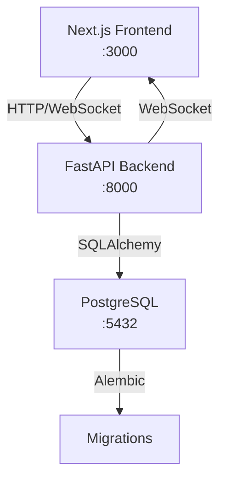

# 🏆 Doqu - The Interactive Real-Time Quiz Platform

Doqu is a real-time quiz platform with AI-powered quiz generation, enhanced player interactions, and advanced host analytics. It features a Next.js frontend, a FastAPI backend, and a PostgreSQL database.

## 🎯 Key Features
- **🎮 Real-time Quiz Games**: Live multiplayer quiz sessions with instant feedback
- **🤖 AI Quiz Generation**: Automatic quiz creation from topics or documents
- **👥 Player Interaction**: Live leaderboards, reactions, and chat
- **🔐 Secure Auth**: JWT-based authentication with Google OAuth
- **📱 Responsive Design**: Works seamlessly on desktop and mobile

## 🗺️ Roadmap

- **🖨️ Worksheet Export**: Export quizzes as printable worksheets (PDF) with customizable formatting.
- **👥 Community Quiz Dashboard**: Browse, search, filter, rate, and comment on public quizzes.
- **📊 Quiz Analytics**: Detailed dashboards for created, played, and saved quizzes, including performance metrics, comments, and ratings.
- **🤼 Team Mode**: Play quizzes in teams with auto-assignment, team chat, and collaborative answering.
- **👤 Profile Page**: View user's created quizzes, recent activity, analytics, and edit profile information.
- **📡 Offline Mode for PWA**: Play quizzes offline with later score synchronization.
- **👓 Spectator Mode**: Watch live games with real-time updates on player answers and aggregate statistics.

## 🚀 Tech Stack

| Layer | Technology | Purpose |
|-------|------------|---------|
| **Frontend** | Next.js 15, TypeScript, Tailwind CSS | Modern React framework with SSR |
| **Backend** | FastAPI, Python 3.12, SQLModel | High-performance async API |
| **Database** | PostgreSQL 16 | Primary data storage |
| **Real-time** | WebSockets (native) | Live quiz interactions |
| **Auth** | JWT tokens, Google OAuth | Secure user authentication |
| **DevOps** | Docker, Dev Containers | Consistent development environment |


## 📂 Directory Structure

```
Doqu/
├── 📁 backend/                  # FastAPI backend service
│   ├── 📁 alembic/              # Database migrations
│   │   ├── versions/            # Migration files
│   │   ├── env.py               # Migration environment
│   │   ├── script.py.mako       # Migration template
│   │   └── README               # Alembic documentation
│   ├── 📁 app/                  # Main application package
│   │   ├── 📁 api/              # REST API endpoints (v1)
│   │   │   ├── auth.py          # Authentication & authorization endpoints
│   │   │   ├── dependencies.py  # FastAPI dependencies
│   │   │   └── user.py          # User management endpoints
│   │   ├── 📁 core/             # Core configurations & settings
│   │   │   └── config.py        # Environment variables & app config
│   │   ├── 📁 db/               # Database layer
│   │   │   ├── base.py          # Database base classes
│   │   │   ├── engine.py        # SQLAlchemy engine configuration
│   │   │   ├── session.py       # Database session management
│   │   │   ├── init_db.py       # Database initialization
│   │   │   └── utils.py         # Database utilities
│   │   ├── 📁 models/           # SQLModel database models
│   │   │   ├── error.py         # Error response models
│   │   │   └── user.py          # User & authentication models
│   │   ├── 📁 services/         # Business logic layer
│   │   │   ├── auth_service.py  # Authentication services
│   │   │   └── user_service.py  # User management services
│   │   ├── 📁 utils/            # Utility functions
│   │   │   └── responses.py     # Response utilities
│   │   ├── 📁 websocket/        # Real-time communication
│   │   │   └── handlers.py      # WebSocket event handlers
│   │   └── main.py              # FastAPI application factory
│   ├── 📁 tests/                # Backend test suite
│   │   ├── conftest.py          # Pytest configuration
│   │   ├── test_auth.py         # Authentication tests
│   │   └── test_user.py         # User management tests
│   ├── 📁 htmlcov/              # Test coverage reports
│   ├── .env.example             # Environment variable templates
│   ├── .flake8                  # Python linting configuration
│   ├── .gitignore               # Git ignore patterns
│   ├── alembic.ini              # Alembic configuration
│   ├── Dockerfile               # Backend container image
│   ├── pyproject.toml           # Python project configuration
│   ├── pytest.ini               # Pytest configuration
│   ├── README.md                # Backend-specific documentation
│   ├── requirements-dev.txt     # Development dependencies
│   └── requirements.txt         # Production dependencies
│
├── 📁 frontend/                 # Next.js frontend service
│   ├── 📁 src/
│   │   ├── 📁 __tests__/        # Frontend test suite
│   │   │   └── simple.test.tsx  # Basic test example
│   │   ├── 📁 app/              # Next.js 15 app directory
│   │   │   ├── api/             # Next.js API routes (proxy)
│   │   │   ├── login/           # Login page
│   │   │   ├── signup/          # Signup page
│   │   │   ├── globals.css      # Global styles & Tailwind
│   │   │   ├── layout.tsx       # Root layout component
│   │   │   └── page.tsx         # Home page component
│   │   ├── 📁 components/       # Reusable React components
│   │   │   ├── auth/            # Auth-specific components
│   │   │   ├── ui/              # Shadcn/ui primitive components
│   │   │   └── shared/           # Shared application components
│   │   ├── 📁 contexts/         # React context providers
│   │   ├── 📁 lib/              # Utility libraries
│   │   │   ├── socket.ts        # WebSocket client configuration
│   │   │   └── utils.ts         # Helper functions
│   │   └── 📁 types/            # TypeScript type definitions
│   │       └── auth.ts          # Authentication-related types
│   ├── 📁 public/               # Static assets
│   ├── .env.example             # Environment variable templates
│   ├── .eslintrc.json           # ESLint configuration
│   ├── .gitignore               # Git ignore patterns
│   ├── .prettierignore          # Prettier ignore patterns
│   ├── .prettierrc              # Prettier configuration
│   ├── components.json          # Shadcn/ui configuration
│   ├── Dockerfile               # Frontend container image
│   ├── eslint.config.mjs        # ESLint configuration
│   ├── jest.config.js           # Jest test configuration
│   ├── jest.setup.js            # Jest setup file
│   ├── next.config.ts           # Next.js configuration
│   ├── package-lock.json        # Node.js lock file
│   ├── package.json             # Node.js dependencies
│   ├── postcss.config.mjs       # PostCSS configuration
│   ├── README.md                # Frontend-specific documentation
│   ├── tailwind.config.ts       # Tailwind CSS configuration
│   └── tsconfig.json            # TypeScript configuration
│
├── 📁 docs/                     # Project documentation
│   └── CONTRIBUTING.md          # Development guidelines
│
├── 📁 .devcontainer/            # VS Code development container
│   └── devcontainer.json        # Dev container configuration
│
├── 📁 .github/                  # GitHub workflows & templates
│   ├── ISSUE_TEMPLATE/          # Issue templates
│   └── PULL_REQUEST_TEMPLATE.md # PR template
│
├── .dockerignore                # Docker ignore patterns
├── .gitignore                   # Git ignore patterns
├── docker-compose.yml           # Multi-service orchestration
├── LICENSE                      # Project license
└── README.md                    # This file
```

## 🏹 Data Flow Architecture



## 📚 Additional Resources

- **[📖 Contributing Guide](docs/CONTRIBUTING.md)** - Development standards and practices
