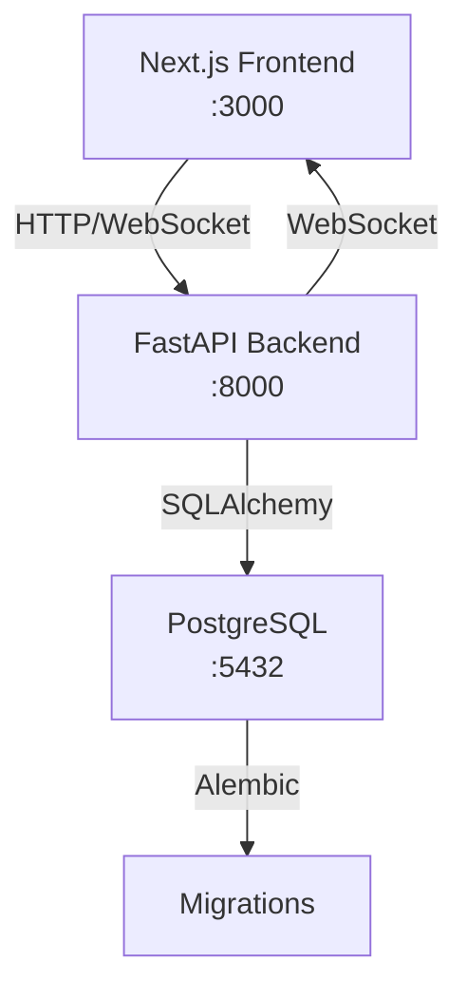

# 🏆 Doqu - The Interactive Real-Time Quiz Platform

Doqu is a real-time quiz platform with AI-powered quiz generation, enhanced player interactions, and advanced host analytics. It features a Next.js frontend, a FastAPI backend, and a PostgreSQL database.

## 🎯 Key Features
- **🎮 Real-time Quiz Games**: Live multiplayer quiz sessions with instant feedback
- **🤖 AI Quiz Generation**: Automatic quiz creation from topics or documents
- **👥 Player Interaction**: Live leaderboards, reactions, and chat
- **🔐 Secure Auth**: JWT-based authentication with Google OAuth
- **📱 Responsive Design**: Works seamlessly on desktop and mobile

## 🗺️ Roadmap

- **🖨️ Worksheet Export**: Export quizzes as printable worksheets (PDF) with customizable formatting.
- **👥 Community Quiz Dashboard**: Browse, search, filter, rate, and comment on public quizzes.
- **📊 Quiz Analytics**: Detailed dashboards for created, played, and saved quizzes, including performance metrics, comments, and ratings.
- **🤼 Team Mode**: Play quizzes in teams with auto-assignment, team chat, and collaborative answering.
- **👤 Profile Page**: View user's created quizzes, recent activity, analytics, and edit profile information.
- **📡 Offline Mode for PGA**: Play quizzes offline with later score synchronization.
- **👓 Spectator Mode**: Watch live games with real-time updates on player answers and aggregate statistics.

## 🚀 Tech Stack

| Layer | Technology | Purpose |
|-------|------------|---------|
| **Frontend** | Next.js 15, TypeScript, Tailwind CSS | Modern React framework with SSR |
| **Backend** | FastAPI, Python 3.12, SQLModel | High-performance async API |
| **Database** | PostgreSQL 16 | Primary data storage |
| **Real-time** | WebSockets (native) | Live quiz interactions |
| **Auth** | JWT tokens, Google OAuth | Secure user authentication |
| **DevOps** | Docker, Dev Containers | Consistent development environment |


## 📂 Directory Structure

```
Doqu/
├── 📁 backend/                  # FastAPI backend service
│   ├── 📁 app/                  # Main application package
│   │   ├── 📁 api/              # REST API endpoints (v1)
│   │   │   ├── auth.py           # Authentication & authorization
│   │   ├── 📁 core/             # Core configurations & settings
│   │   │   └── config.py         # Environment variables & app config
│   │   ├── 📁 db/               # Database layer
│   │   │   ├── engine.py         # SQLAlchemy engine configuration
│   │   │   ├── session.py        # Database session management
│   │   │   ├── init_db.py        # Database initialization
│   │   │   └── utils.py          # Database utilities
│   │   ├── 📁 models/           # SQLModel database models
│   │   │   ├── user.py           # User & authentication models
│   │   ├── 📁 websocket/        # Real-time communication
│   │   │   └── handlers.py       # WebSocket event handlers
│   │   ├── main.py               # FastAPI application factory
│   │   └── __init__.py           # Package initialization
│   ├── 📁 alembic/              # Database migrations
│   ├── 📁 tests/                # Backend test suite
│   ├── requirements.txt          # Production dependencies
│   ├── requirements-dev.txt      # Development dependencies
│   ├── .env.example              # Environment variable templates
│   ├── pyproject.toml            # Python project configuration
│   ├── Dockerfile                # Backend container image
│   └── README.md                 # Backend-specific documentation
│
├── 📁 frontend/                 # Next.js frontend service
│   ├── 📁 src/
│   │   ├── 📁 app/              # Next.js 15 app directory
│   │   │   ├── api/              # Next.js API routes (proxy)
│   │   │   ├── login/            # Authentication pages
│   │   │   ├── globals.css       # Global styles & Tailwind
│   │   │   ├── layout.tsx        # Root layout component
│   │   │   └── page.tsx          # Home page component
│   │   ├── 📁 components/       # Reusable React components
│   │   │   ├── ui/               # Shadcn/ui primitive components
│   │   │   └── shared/           # Shared application components
│   │   └── 📁 contexts/         # React context providers & state management
│   │   ├── 📁 lib/              # Utility libraries
│   │   │   ├── socket.ts         # WebSocket client configuration
│   │   │   ├── utils.ts          # Helper functions
│   │   │   └── api.ts            # API client configuration
│   │   ├── 📁 types/            # TypeScript type definitions
│   │   │   └── auth.ts           # Authentication-related types
│   │   └── 📁 __tests__/        # Frontend test suite
│   ├── 📁 public/               # Static assets
│   ├── package.json              # Node.js dependencies
│   ├── tsconfig.json             # TypeScript configuration
│   ├── next.config.ts            # Next.js configuration
│   ├── tailwind.config.ts        # Tailwind CSS configuration
│   ├── .env.example              # Environment variable templates
│   ├── Dockerfile                # Frontend container image
│   └── README.md                 # Frontend-specific documentation
│
├── 📁 docs/                     # Project documentation
│   └── CONTRIBUTING.md           # Development guidelines
│
├── 📁 alembic/                  # Root-level migrations (shared)
├── 📁 .devcontainer/            # VS Code development container
├── 📁 .github/                  # GitHub workflows & templates
├── alembic.ini                   # Alembic configuration
├── docker-compose.yml            # Multi-service orchestration
├── docker-compose.override.yml   # Local development overrides
├── .gitignore                    # Git ignore patterns
├── LICENSE                       # Project license
└── README.md                     # This file
```

## 🏹 Data Flow Architecture



## 📚 Additional Resources

- **[📖 Contributing Guide](docs/CONTRIBUTING.md)** - Development standards and practices
